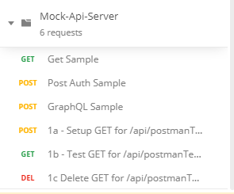

# mock-api-server
ASPNet Core 3.x Webserver that can be used to mock any API request.  The web server supports most RESTful operations as well as standard http requests.  The mock server can also be confugured to respond to GraphQL request providing that the GraphQL endpoint is `/graphql`

## Getting started

Clone the repository and build the solution by running, command below, in the repository root.  Make sure all the nuget packages were restored and that the solution build successfully.
```
dotnet build
```

Start the `Mock-Api-Server` with optionally add ```-- urls https://localhost:<<port>>``` to specify a custom port. Defaults are http (5000) and https (5001)
```
dotnet run --project .\MockApiServer\MockApiServer.csproj
```

Execute ```https://localhost:5001/api/sample``` to test the with a provided sample document and verify that the below response was received.
```
{"Id":"SampleId","Name":"SampleName"}
```

### Samples
### [Postman collection](./src/Samples/PostMan/Mock-Api-Server.postman_collection.json)
Located in ```src/Samples/PostMan/Mock-Api-Server.postman_collection.json```



# TODO
 - Expectations Samples (Setup, Execute and Verify calls)
 - Setup GraphQL Samples
    >See `CRUD_GivenValidGraphQL_ShouldCreateReadUpdateDelete()`
 - GraphQL Expectations Samples (Setup, Execute and Verify calls)
    >See ```ExpectOne_GiveValidGraphQlSetupAndValidRequest_ShouldVerify```
 - Setup Tests with RAZOR syntax responses
    >See ```CRUD_GivenValidInputWithQueryStringAndRazor_ShouldCreateReadUpdateDelete```
    > and sample file ```post_auth.razor```
 - Create BULK upload for Setups
